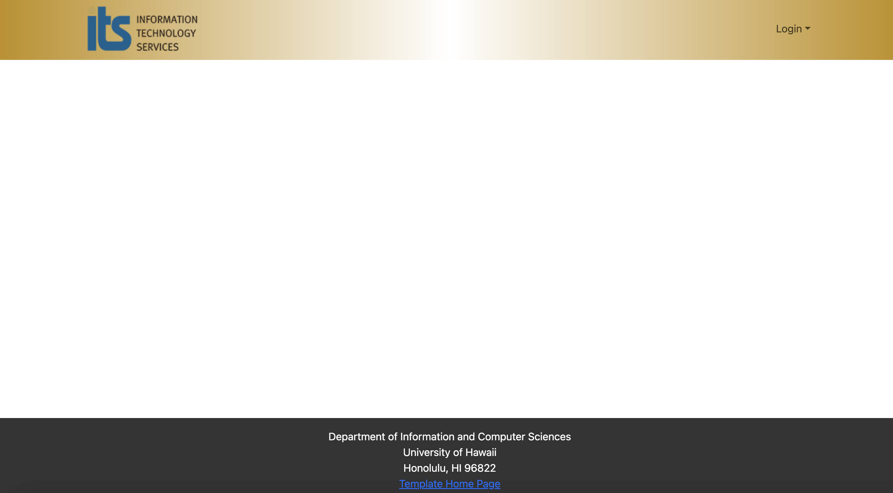
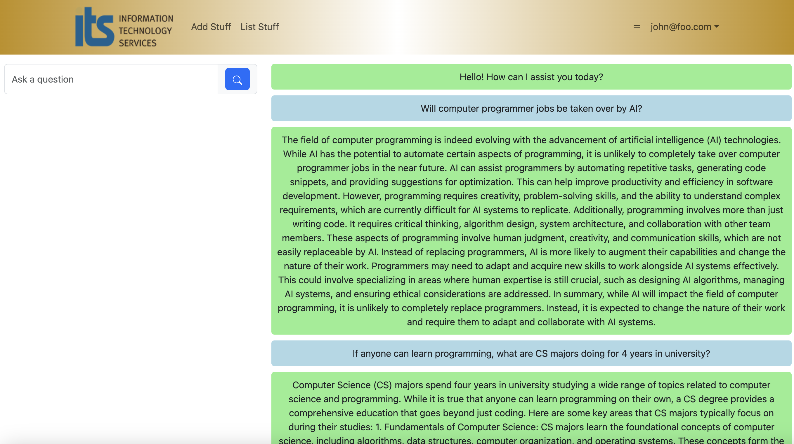

### Team Members

This application is designed, implemented, and maintained by [James Ligeralde](https://jligeral.github.io/), [Frances Michelle Uy](https://frances-uy.github.io/), [Jonathan Sapolu](https://jsapolu99.github.io/) and [Michelle Ho](https://michho8.github.io/).

### Strategy

Our project follows the Issue Driven Project Management (IDPM) guidelines. We will be holding our meetings once a week on Mondays and Wednesdays from 6-7 PM via discord. Additionally, each team member will provide frequent updates regarding their assigned tasks via our discord chat. Tasks will be assigned as GitHub issues for each respective member, though other members are encouraged to help as needed. To track our development, we will establish milestones every 7-14 days.

### ITS Ask Us

The goal of this project is improve the searching effectiveness of the University of Hawaii's Ask Us search engine, which takes in user queries and attempts to return a list of IT-related articles that may help the users resolve their IT issues. We will be attempting to implement an AI search engine which will hopefully alleviate the need to contact the IT help desk.

We want this AI search engine to be able to to respond to queries as helpfully as possible. This means being able to ask follow-up questions to unclear queries and being conversational.

We plan on providing the interface for all users at the landing page, but also want to provide login capabilities in order for the AI to be able to store previous chat sessions.

### The Big Picture

#### Landing page

When you retrieve the app at http://localhost:3000, this is what should be displayed:

#### Once logged in

#### Project breakdown

