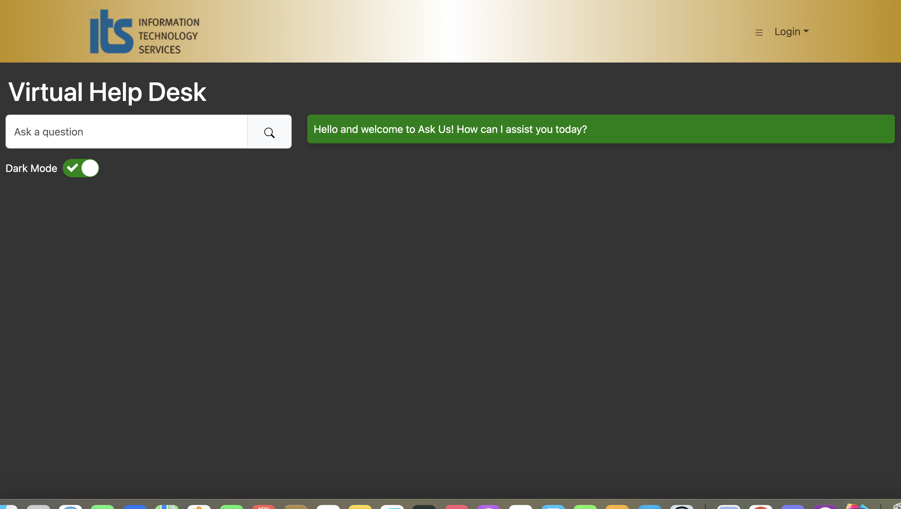
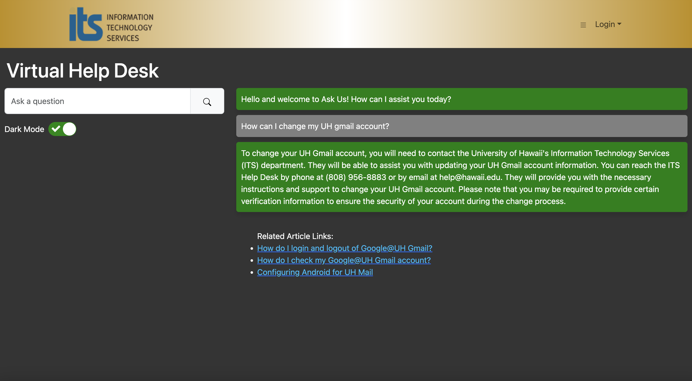

# tryRebooting

## [Our Application's Deployment](http://137.184.70.155/)

### Strategy

Our project follows the Issue Driven Project Management (IDPM) guidelines. Due to very incompatible schedules, all team members will likely only meet in person during class on Monday and Wednesday mornings. Our primary mode of communication is done through Discord. Furthermore each member is assigned different tasks that are agreed upon between the assigner and assignee, with each task listed as an issue on the [source code repository](https://github.com/tryRebooting2023/askus).

### ITS Ask Us

The goal of this project is improve the searching effectiveness of the University of Hawaii's Ask Us search engine, which takes in user queries and attempts to return a list of IT-related articles that may help the users resolve their IT issues. We will be attempting to implement an AI search engine which will hopefully alleviate the need to contact the IT help desk.

We want this AI search engine to be able to to respond to queries as helpfully as possible. This means being able to ask follow-up questions to unclear queries and being conversational.

We plan on providing the interface for all users at the landing page, but also want to provide login capabilities in order for the AI to be able to store previous chat sessions.

### The Application Anatomy

#### Landing page

Upon entering the [application's site](http://137.184.70.155/), this is what should be displayed:

Users will immediately be allowed to use the Chat function upon landing. The input group to the left will send user queries to OpenAI for it to process and then return a statement intended to answer the input query. The navigation bar at the top is present on all pages and the logo, on click, will return users to landing or home depending on if the user is logged in. In addition to the logo is a dropdown menu with links to other parts other parts of UH's main site, including a contact page for ITS.

#### Once logged in

Users are either admin or non-admin. Their home pages are currently identical, but we do plan to implement additional features for logged in users. For admin users, in particular, we will will grant them access to a 'user feedback' page which should provide a list of queries and their associated AI-generated responses along with a positive or negative rating. This will be discussed in a later section. Non-Admins will have the chat updated to generate a form with each response asking if the response was good or bad. This information will be archived to the 'user feedback' page. 

#### Project breakdown

Our initial work involved setting up the chatbot and the databases. As illustrated in the diagram above, we had to parse several HTML files of its important text content, split the contents of each article into smaller chunks of text, convert these chunks into arrays of vectors, and then store these arrays into a dedicated vector database. We accomplished this by introducing additional technolgies. [Cheerio](https://cheerio.js.org/) was used to parse the HTML content into a CSV file, which we then fed to [LangChain](https://js.langchain.com/docs/get_started/introduction). [OpenAI](https://openai.com/) provided us with the tools to create the text embeddings, and we utilized [Pinecone](https://docs.pinecone.io/docs/overview) to store our collection of embeddings.

On the other end, OpenAI was also used to provide the chat bot. We set up the bot to create embeddings of the user query and directly compare those embeddings to those within Pinecone's index in process called [Cosine Similarity](https://en.wikipedia.org/wiki/Cosine_similarity), which enables the semantic search operation our application was set to employ. Unfortunately, the construction process of the application took more time than we anticipated, so general UI was minimal at best.

#### Development history

[M1 - October 25 - November 15](https://github.com/orgs/tryRebooting2023/projects/1/views/1)  
[M2 - November 15 - Present](https://github.com/orgs/tryRebooting2023/projects/2/views/1)

### Team Contract Link:
[Click Here](https://docs.google.com/document/d/15H0tS0bpVW0NQiGvWMAU79zyLRmt6mj2KbrBsFjrVd8/edit?usp=sharing)

### Team Members

This application is designed, implemented, and maintained by [James Ligeralde](https://jligeral.github.io/), [Frances Michelle Uy](https://frances-uy.github.io/), [Jonathan Sapolu](https://jsapolu99.github.io/) and [Michelle Ho](https://michho8.github.io/).
