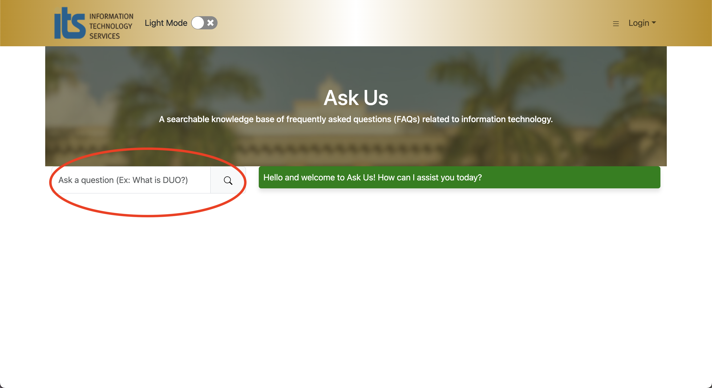
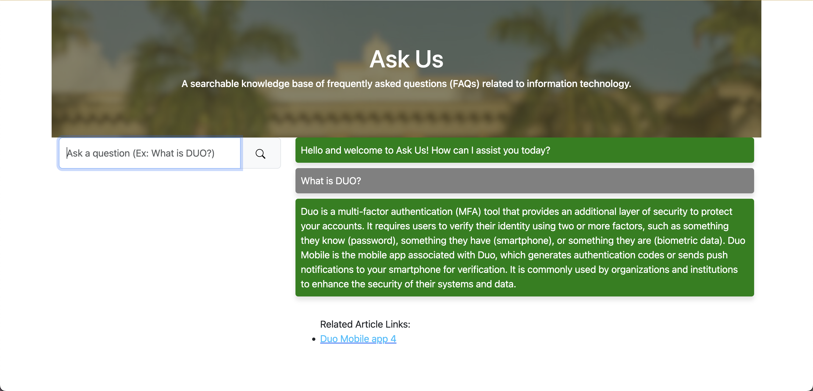
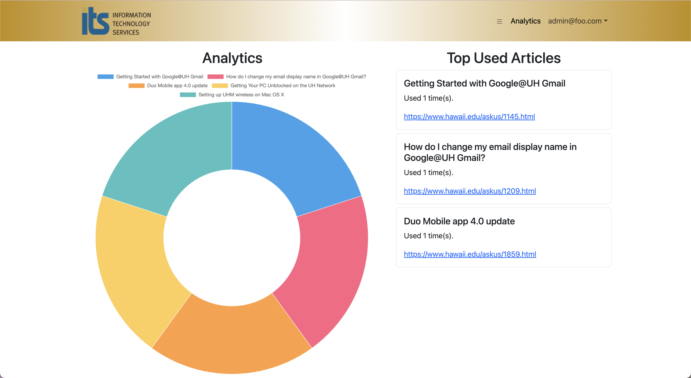
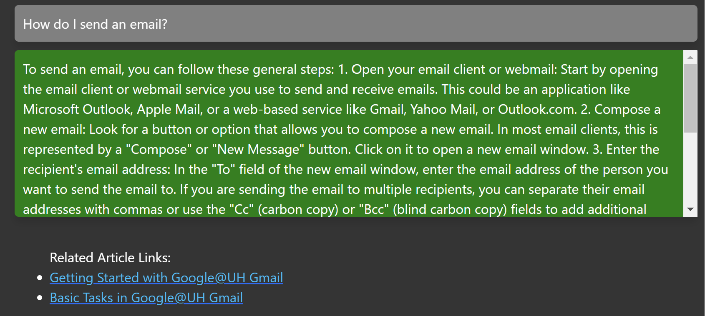
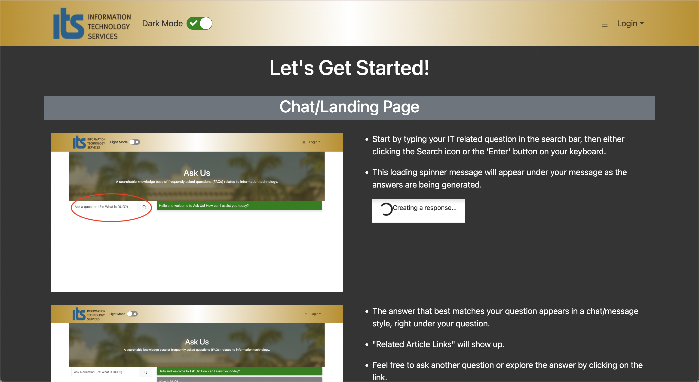
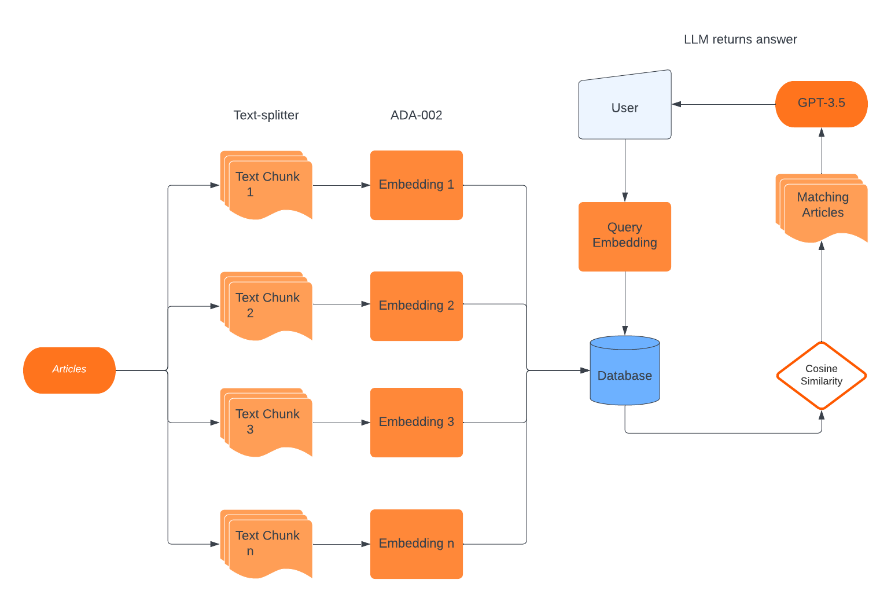

# tryRebooting's Ask Us

## [Our Deployed Project](https://askusits.site/)

## Table of Contents
- [Strategy](#strategy)
- [ITS Ask Us Overview](#its-ask-us-overview)
- [User Guide](#user-guide)
  - [Landing Page](#landing-page)
  - [Navigation Bar](#navigation-bar)
  - [Dark mode](#dark-mode)
  - [Once logged in](#once-logged-in)
  - [Scrolling through a message](#scrolling-through-a-message)
  - [Tutorial Page](#tutorial-page)
- [Development Guide](#development-guide)
- [Development history](#development-history)
- [Team Contract Link](#team-contract-link)
- [Team Members](#team-members)

### Strategy

Our project follows the Issue Driven Project Management (IDPM) guidelines. Due to very incompatible schedules, all team members will likely only meet in person during class on Monday and Wednesday mornings. Our primary mode of communication is done through Discord. Furthermore each member is assigned different tasks that are agreed upon between the assigner and assignee, with each task listed as an issue on the [source code repository](https://github.com/tryRebooting2023/askus).

### ITS Ask Us Overview

The goal of this project is to improve the searching effectiveness of the University of Hawaii's Ask Us search engine, which takes in user queries and attempts to return a list of IT-related articles that may help the users resolve their IT issues. We will be attempting to implement an AI search engine which will hopefully alleviate the need to contact the IT help desk representative.

We want this AI search engine to be able to respond to queries as helpfully as possible for anyone with a specific question, or even a general topic to a question. This means being able to ask follow-up questions to unclear queries and being conversational.

We plan on providing the interface for all users at the landing page, but also want to provide login capabilities in order for the AI to be able to store previous chat sessions. This includes "admin" accounts that have access to our "Analytics" page that helps to show the most popular articles used as references to form a response.

## User Guide

### Landing page

Upon entering the [application's site](https://askusits.site/), this is what should be displayed:




Users will immediately be allowed to use the Chat function upon landing. This is for the convenience of the general public being able to use it, right away. The input group to the left will send user queries to OpenAI for it to process and then return a response intended to answer the input query. 

### Navigation Bar


The navigation bar at the top is present on all pages and allows for quick navigation through different pages. The logo, on click, will return users to the landing or home depending on if the user is logged in. The dropdown menu on the top right includes links to other pages of the UH ITS main site, such as a "About" page. Of course, there will be a drop down under the "LOGIN" tab to sign-up or sign-in. This is also where the user's email will be shown when logged in.l 

### Dark mode


We also offer a "dark mode" that the user may toggle on/off with the switch. This feature was decided as necessary as it reduces eye strain and cuts glare, especially at nighttime. We strive to maximize our audience's comfort while using our application. We have future ideas for personalization features to better satisfy a broad range of preferences.

### Once logged in

Users are either admin or non-admin. Their home pages are currently identical. Admin users in particular are granted access to an 'Analytics' page which should provide a list of queries and their associated AI-generated responses along with a positive or negative rating. This allows for an easy visual representation of which articles have been referenced the most which enables developers and ITS employees to concentrate on improving ease of access to these particular articles.



### Scrolling through a message



When a response is large enough, we enable a scrollable feature for that single response in order to reduce the space taken up by the number of responses. As seen in the screenshot, the user is able to scroll down the singular message without needing to move the other responses. It is currently being debated whether we want the whole conversation compacted and scrollable or continue using the singular, scrollable response. With M2 completed, the conversation will now automatically scroll down to the most recent response.

### Tutorial Page



Detailed intructions of our site can be found through the ʻTutorialʻ page, accessed through the toggle dropdown in the navigation bar. We included screenshots of the particular sections on our page in order to make it easy for readers to follow.

## Community Feedback

## Developer Guide

This section provides information of interest to Meteor developers wishing to use this code base as a basis for their own development tasks.

### Initialization

1. Install [Meteor.](https://www.meteor.com/install)
2. Visit the [Ask Us application github page](https://tryrebooting2023.github.io/), and click the “Use this template” button to create your own repository initialized with a copy of this application. Alternatively, you can download the sources as a zip file or make a fork of the repo. However you do it, download a copy of the repo to your local computer.
3. cd into the askus/app directory (using `cd app`) and install libraries with:
``
meteor npm install
``
4. You need to create environment keys and follow these instructions:
##### Environment Keys

An `openaiApiKey` must be set up from [OpenAI](https://help.openai.com/en/articles/5112595-best-practices-for-api-key-safety) and a `pineconeApiKey`, `pineconeEnvironment`, and `pineconeIndex` must be set up from  [Pinecone](https://docs.pinecone.io/docs/quickstart) in order for the chat to function. Please refer to their respective API Quickstart guides on best practices for this. Do not share personal keys with anyone, and keep them safe.

Create a `settings.json` file and paste this template into it. Replace keys you made where appropriate.

```{
  "defaultData": [
    { "name": "Basket", "quantity": 3, "owner": "john@foo.com", "condition": "excellent" },
    { "name": "Bicycle", "quantity": 2, "owner": "john@foo.com", "condition": "poor" },
    { "name": "Banana", "quantity": 2, "owner": "admin@foo.com", "condition": "good" },
    { "name": "Boogie Board", "quantity": 2, "owner": "admin@foo.com", "condition": "excellent" }
  ],

  "OPENAI_API_KEY": "your-openai-api-key",
  "PINECONE_API_KEY": "your-pinecone-api-key",
  "PINECONE_ENVIRONMENT": "your-pinecone-environment",
  "PINECONE_INDEX": "your-pinecone-index"
}
```

5. Run the system with: `meteor npm run start`

If all goes well, the application will appear at http://localhost:3000.

## Project breakdown



Our initial work involved setting up the chatbot and the databases. As illustrated in the diagram above, we had to parse several HTML files of its important text content, split the contents of each article into smaller chunks of text, convert these chunks into arrays of vectors, and then store these arrays into a dedicated vector database. We accomplished this by introducing additional technologies.         [Cheerio](https://cheerio.js.org/) was used to parse the HTML content into a CSV file, which we then fed to [LangChain](https://js.langchain.com/docs/get_started/introduction).  [OpenAI](https://openai.com/) provided us with the tools to create the text embeddings. [Pinecone](https://docs.pinecone.io/docs/overview) was utilized to store our collection of embeddings.


On the other end, OpenAI was also used to provide the chat bot. We set up the bot to create embeddings of the user query and directly compare those embeddings to those within Pinecone's index in a process called [Cosine Similarity](https://en.wikipedia.org/wiki/Cosine_similarity), which enables the semantic search operation our application was set to employ. Unfortunately, the construction process of the application took more time than we anticipated, so in general the UI was minimal at best.

## Quality Assurance

## ESLint

Ask Us includes a .eslintrc file to define the coding style adhered to in this application. You can invoke ESLint from the command line as follows:

``meteor npm run lint``

Here is sample output indicating that no ESLint errors were detected:


````
$ meteor npm run lint

> meteor-application-template-react@ lint /Users/michelleuy/Desktop/github/askus/app
> eslint --quiet --ext .jsx --ext .js ./imports && eslint --quiet --ext .js ./tests

$
````
ESLint should run without generating any errors.

It’s significantly easier to do development with ESLint integrated directly into your IDE (such as IntelliJ).

##### End to End Testing

Ask Us uses TestCafe to provide automated end-to-end testing.

To run the end-to-end tests in development mode, you must first start up a Ask Us instance by invoking meteor npm run start in one console window.

Then, in another console window, start up the end-to-end tests with:

``meteor npm run testcafe``

You will see browser windows appear and disappear as the tests run. If the tests finish successfully, you should see the following in your second console window:

```
 % meteor npm run testcafe

> meteor-application-template-react@ testcafe /Users/michelleuy/Desktop/github/askus/app
> testcafe chrome tests/*.testcafe.js

 Running tests in:
 - Chrome 119.0.0.0 / Ventura 13

 meteor-application-template-react localhost test with default db
 ✓ Test that landing page shows up
 ✓ Test that signin and signout work
 ✓ Test the Analytics page
 ✓ Test the Tutorial page
 ✓ Test search function


 5 passed (21s)
(base) michelleuy@MacBook-Pro-28 app %
```


### Development history

[M1 - October 25 - November 15](https://github.com/orgs/tryRebooting2023/projects/1/views/1) 

[M2 - November 15 - November 27](https://github.com/orgs/tryRebooting2023/projects/2/views/1)

[M3 - November 27 - Present](https://github.com/orgs/tryRebooting2023/projects/3/views/1) 

Our primary goal at this point is to collect user feedback and make improvements based on that. We also aim to improve UI design to further streamline application features.

### Team Contract Link:
[Click Here](https://docs.google.com/document/d/15H0tS0bpVW0NQiGvWMAU79zyLRmt6mj2KbrBsFjrVd8/edit?usp=sharing)

### Team Members

This application is designed, implemented, and maintained by [James Ligeralde](https://jligeral.github.io/), [Frances Michelle Uy](https://frances-uy.github.io/), [Jonathan Sapolu](https://jsapolu99.github.io/) and [Michelle Ho](https://michho8.github.io/). 

For contact information, please visit our contract link.
